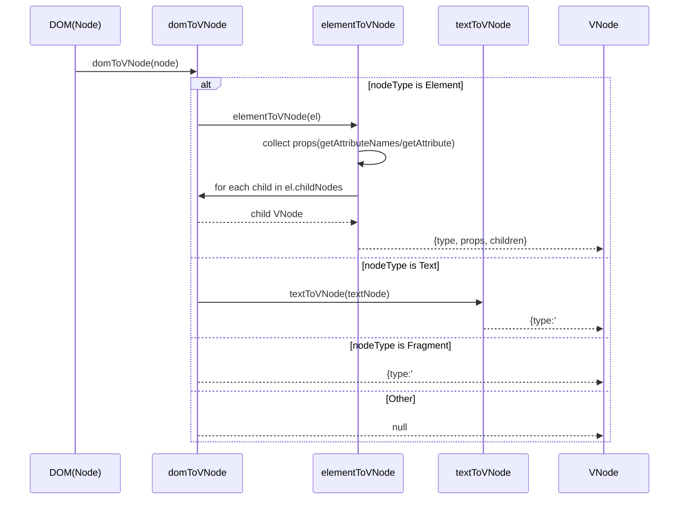
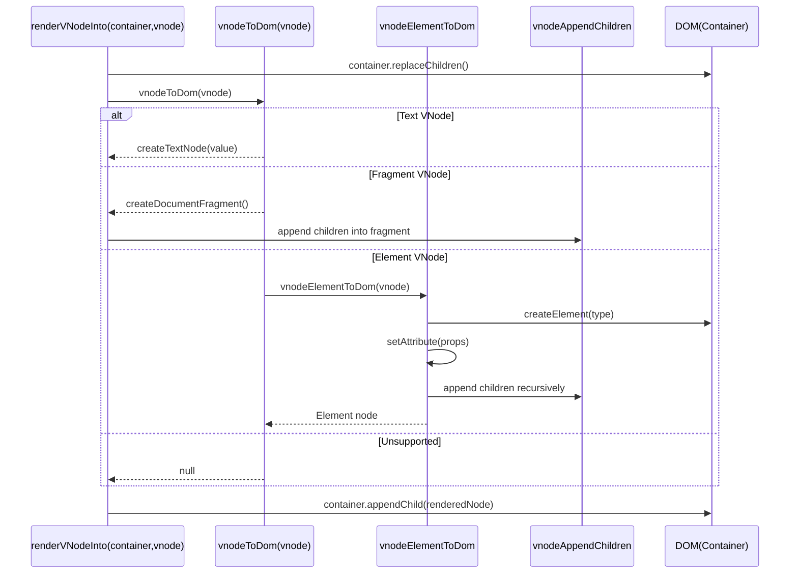
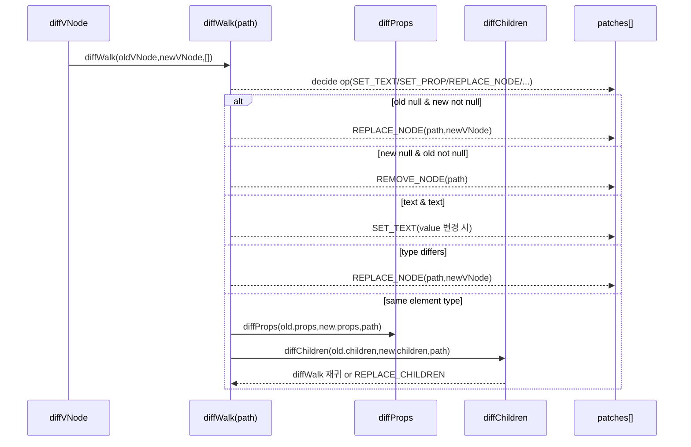
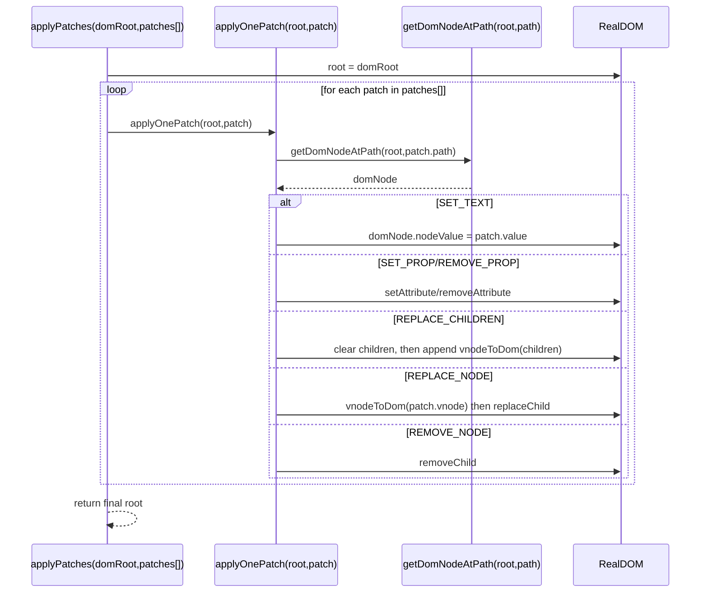
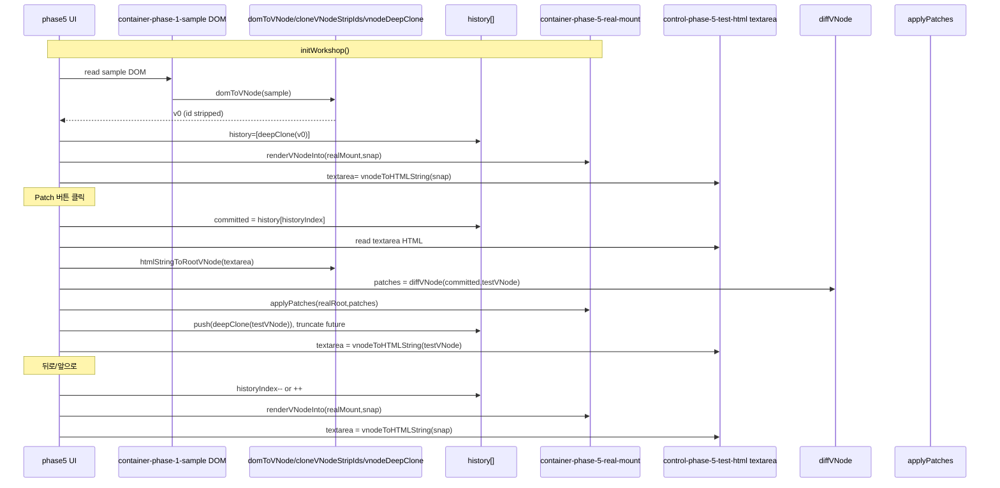
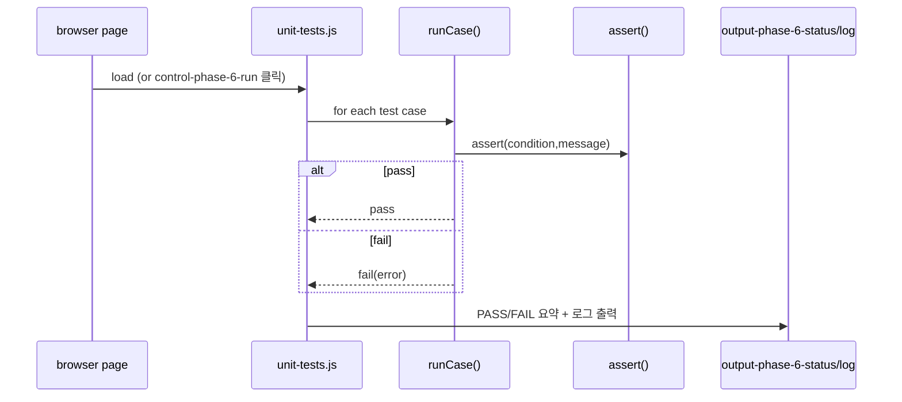

# 구현 단계 문서 (Virtual DOM / Diff 과제)

과제 **원문 요구사항·발표 조건**은 [`requirements.md`](requirements.md)에 정리해 두었다.

이 문서는 **무엇을 어느 단계에서 했는지**와 **다음에 무엇을 할지**만 짧게 남긴다.  
질문하며 따라가기 좋게, 코드의 상세 설명은 각 파일 주석을 우선한다.

---

## 학습 노트 (질문 기반 핵심 정리)

이 문서는 “무엇이/왜” 헷갈리는지를 발표용 관점에서 짧게 정리한다.

### 1) 왜 VNode(스냅샷)인가?
- diff는 **old/new 값 비교**가 핵심이므로, DOM 대신 **순수 객체 트리(VNode)** 를 비교 재료로 둔다.
- 히스토리(뒤로/앞으로)는 “그 시점의 UI”를 **스냅샷으로 저장**해야 해서 VNode가 유리하다.

### 2) diff/patch는 언제 일어나는가?
- 이 구현은 DOM을 관찰해서 자동 diff를 돌리지 않는다.
- `5단계`: 사용자가 `Patch` 버튼을 누르는 순간 `diffVNode(committed, testVNode)`를 계산하고, 그 다음 `applyPatches(...)`로 실제 DOM을 변경한다.

### 3) 공백/줄바꿈 텍스트 노드는 왜 보이나?
- `domToVNode`가 자식을 모을 때 `childNodes`를 사용한다.
- 따라서 요소 사이 줄바꿈/공백이 텍스트 노드(`type: '#text'`)로 VNode에 포함될 수 있다.

### 4) 구조 교체는 언제 필요한가?
- `REPLACE_NODE`: `type`이 다를 때(태그/노드종류 교체)
- `REPLACE_CHILDREN`: 자식 길이가 다를 때(이 구현의 단순화 정책)

### 5) React는 무엇을 비슷하게 하나?
- React도 큰 방향은 “가상 표현 비교 후 최소 변경 커밋”이다.
- 다만 이 데모는 그 과정을 diff/patch로 눈에 보이게 분리해 학습하도록 만든다.

---

## 1단계 — 실제 DOM → Virtual DOM (VNode)

### 목표

- 브라우저가 들고 있는 **실제 DOM 서브트리**를 읽어, **순수 JS 객체/배열 트리**로 옮긴다.
- 이 트리는 나중에 **스냅샷 저장·비교(diff)** 하기 쉬운 **값(value) 트리**여야 한다. (JSON 은 그걸 드러내는 대표 예시 — 이유는 위 「학습 노트」 참고)

### 구현 내용

- **`domToVNode(node)`** (`js/vdom.js`)
  - `ELEMENT_NODE` → `{ type, props, children }`
  - `TEXT_NODE` → `{ type: '#text', value }`
  - `DOCUMENT_NODE` → `document.documentElement` 만 재귀 (루트가 document 일 때 편의)
  - `DOCUMENT_FRAGMENT_NODE` → `{ type: '#document-fragment', children }`
  - 그 외(예: 주석) → `null`, 부모 `children` 에 포함하지 않음
- **자식 수집:** `childNodes` 사용 (텍스트·요소 모두 포함, 원본 DOM 에 충실)
- **속성:** `getAttributeNames` / `getAttribute` 로 문자열 맵 `props` 에 저장

### 시퀀스 다이어그램 (DOM → VNode)

### 다이어그램 해설 (읽는 법)
이 다이어그램은 `domToVNode`가 DOM 노드의 `nodeType`을 보고 “어떤 VNode 형태를 만들지”를 결정하는 과정을 보여줍니다.

- `DOMRoot->>Conv: domToVNode(node)`는 변환 시작점을 의미합니다.
- `alt nodeType is Element/Text/Fragment/Other`는 `domToVNode`의 `switch(node.nodeType)` 분기를 의미합니다.
- Element 분기에서 `elementToVNode(el)`가 호출되고, 그 안에서 `props`를 수집한 뒤 `el.childNodes`를 순회하며 각 자식을 다시 `domToVNode`로 변환합니다.
- `Conv-->>Elem: child VNode`와 `Elem-->>Out: {type, props, children}`은 “자식 변환 결과를 children 배열에 누적해서 최종 VNode를 조립”한다는 뜻입니다.
- Text 분기에서는 텍스트 노드의 문자열을 `value`로 저장하는 `textToVNode`가 반환하는 형태가 그대로 보입니다.
- Other는 주석 같은 지원하지 않는 노드를 `null`로 반환하고 부모의 children에 포함되지 않음을 의미합니다.

관찰 포인트는 “실제로 눈에 보이지 않는 줄바꿈/공백도 childNodes에 텍스트 노드로 남을 수 있어서, VNode JSON에 `#text`가 함께 등장할 수 있다”는 부분입니다. 이게 diff 입력이 어떤 단위를 포함하는지 이해하게 해줍니다.

### 흐름 포인트
- `nodeType` 분기 후, Element면 `props` + `children` 재귀 구성
- `childNodes`를 써서 공백/줄바꿈도 `#text`로 들어갈 수 있음

### 검증 방법

1. `index.html` 을 브라우저로 연다.
2. 가운데 열에서 `outerHTML`·트리 요약, 오른쪽에서 VNode JSON 이 채워지는지 본다.
3. 샘플 HTML 을 고치고 새로고침 → JSON 구조가 기대와 맞게 바뀌는지 본다.
4. **엣지로 볼 것:** 태그 사이 줄바꿈 때문에 **공백 전용 텍스트 노드**가 VNode 에 나타날 수 있음 (브라우저 파싱 특성).

### 알려진 한계 / 이후 결정 사항

- `style` 은 문자열 그대로 — 나중에 객체 분리할지 선택.
- 주석 노드 무시 — 필요 시 확장.
- 네임스페이스(XML/SVG) 고급 처리는 생략 가능.

---

## 2단계 — Virtual DOM → DOM (완료)

### 목표

- VNode 순수 객체 트리를 `createElement` / `createTextNode` 로 **실제 Node 트리**로 복원한다.
- 컨테이너를 비운 뒤 한 번에 붙이는 **`renderVNodeInto(container, vnode)`** 로 과제의 “테스트 영역 초기 렌더” 흐름을 연습한다.

### 구현 내용 (`js/vdom.js`)

- **`vnodeToDom(vnode)`** — `TEXT` / 요소 태그 / `#document-fragment` 분기, 미지원 type 은 `null`.
- **`vnodeElementToDom`** — `props` 를 `setAttribute` 로 반영 (`true` → 빈 문자열 속성).
- **`vnodeAppendChildren`** — 자식 VNode 를 재귀적으로 DOM 에 연결.
- **`renderVNodeInto(container, vnode)`** — `container.replaceChildren()` 후 루트 노드(또는 fragment) 부착.

### 시퀀스 다이어그램 (VNode → DOM)

### 다이어그램 해설 (읽는 법)
이 다이어그램은 “VNode 스냅샷을 실제 DOM 노드로 복원”하는 과정을, 생성 단계와 컨테이너 부착 단계로 나눠 보여줍니다.

- `container.replaceChildren()`은 렌더링 전에 기존 DOM을 비우는 동작입니다(통째 렌더 전략).
- `renderVNodeInto -> vnodeToDom`은 “루트 VNode를 실제 Node로 바꾸는 책임”이 `vnodeToDom`에 있음을 나타냅니다.
- `alt Text/Fragment/Element`는 `vnodeToDom`이 `vnode.type`을 보고 생성 방식을 분기한다는 뜻입니다.
- Text에서는 `document.createTextNode(value)`가 반환되고, 그대로 `container.appendChild(renderedNode)`로 붙습니다.
- Fragment에서는 `document.createDocumentFragment()`를 만들고, 자식들을 `vnodeAppendChildren`로 붙인 뒤 결과를 컨테이너에 붙입니다.
- Element에서는 `vnodeElementToDom`이 `createElement(type)`, `setAttribute(props)`, 그리고 `vnodeAppendChildren`의 재귀 호출로 자식들을 붙입니다.

관찰 포인트는 이 단계가 “diff로 만든 patches의 결과가 실제 DOM에서 동일 구조로 재현되는지”를 확인하는 검증 역할도 한다는 점입니다.

### 흐름 포인트
- VNode 생성은 `vnodeToDom` 계열이 담당하고, 실제 컨테이너 부착은 `renderVNodeInto`가 담당한다.
- `renderVNodeInto`는 컨테이너를 비운 뒤 루트를 통째로 붙이는 흐름이라 “초기 렌더/복원”에 적합하다.

### 데모

- `container-phase-2-mount` — `domToVNode(container-phase-1-sample)` 의 **id 제거 복제본** 렌더.

### 검증 방법

1. 새로고침 후 하단 **2단계** 패널에 왼쪽 샘플과 거의 같은 모양이 보이는지 확인한다.
2. 개발자 도구 Elements 로 샘플 루트와 mount 내부 트리를 비교한다(텍스트·속성·중첩).
3. `id`는 복제본에서 빠져 있음을 확인한다.

### 알려진 한계 / 이후

- `innerHTML` / 이벤트 리스너는 2단계 범위 밖. Diff·Patch 단계에서 최소 갱신으로 발전.

---

## 3단계 — Diff (완료)

### 목표

- 이전·다음 VNode 를 트리 순회로 비교해 **적용 가능한 패치 연산 배열**로 만든다.

### 구현 내용 (`js/diff.js`)

- **`diffVNode(oldVNode, newVNode)`** — 루트에서 `diffWalk` 시작, `path`는 자식 인덱스 배열(`[]` = 루트).
- **텍스트**: 내용만 다르면 `SET_TEXT`.
- **타입 불일치**(태그 변경, 텍스트↔요소 등): `REPLACE_NODE`.
- **요소 동일 태그**: `diffProps` → `REMOVE_PROP` / `SET_PROP`.
- **자식**: 길이 같으면 인덱스마다 재귀; **길이 다르면** `REPLACE_CHILDREN`(전체 자식 교체).

### 시퀀스 다이어그램 (Diff → patches[])

### 다이어그램 해설 (읽는 법)
이 다이어그램은 `diffVNode`가 내부적으로 `diffWalk`를 재귀 호출하며, 최종적으로 patches[]를 “명령 목록” 형태로 만들어내는 과정을 보여줍니다.

- `diffVNode(old,new)`는 루트에서 `diffWalk(..., path=[])`를 시작합니다.
- `alt ...` 분기는 `diffWalk` 내부의 if/return 흐름과 1:1로 대응됩니다.
- 텍스트 분기에서는 value가 다를 때만 `SET_TEXT`를 추가하고, 같으면 더 내려가지 않고 종료합니다.
- 타입이 다르면 하위 비교를 건너뛰고 `REPLACE_NODE`로 서브트리를 통째로 교체하는 결정을 보여줍니다.
- 같은 요소 타입이면 먼저 `diffProps`로 `SET_PROP`/`REMOVE_PROP`를 계산하고, 그 다음 `diffChildren`으로 자식 비교를 진행합니다.
- 자식 비교는 길이가 같을 때만 인덱스별 재귀 diff가 되고, 길이가 다르면 이 구현 정책대로 `REPLACE_CHILDREN`으로 “통째 교체”가 됩니다.

관찰 포인트는 diff가 “DOM을 바꾸지 않는다”는 점이며, output은 항상 patches[]라는 데이터라는 점입니다.

### 흐름 포인트
- diff는 DOM을 바꾸지 않고, `patches[]` 명령 목록만 계산한다.
- `path`로 “어디를” 지정하고, `op`로 “무엇을” 바꿀지 정의한다.

### 데모 ([`index.html`](../index.html))

- `control-phase-3-scenario` — 동일 / id 제거 / 제목 수정.
- `output-phase-3-vnode-old` / `output-phase-3-vnode-new` — diff에 넣는 이전·이후 VNode JSON.
- `output-phase-3-patches` — `patchCount`, `patches`.

### 알려진 한계

- 리스트 **key 없음** → 중간 삽입 최적화 없음(`REPLACE_CHILDREN` 사용).

---

## 4단계 — Patch (완료)

### 목표

- `diffVNode` 결과를 **같은 path 규칙**으로 실제 DOM 노드에 반영한다.

### 구현 (`js/patch.js`)

- **`getDomNodeAtPath(root, path)`** — `childNodes` 인덱스 체인.
- **`applyPatches(domRoot, patches)`** — 순차 적용, `REPLACE_NODE` 가 `path:[]` 이면 새 루트 반환.
- 지원 연산: `SET_TEXT`, `SET_PROP`, `REMOVE_PROP`, `REPLACE_CHILDREN`, `REPLACE_NODE`, `REMOVE_NODE`.

### 시퀀스 다이어그램 (patch 실행: applyPatches)

### 다이어그램 해설 (읽는 법)
이 다이어그램은 `patch.js`의 핵심 실행 경로인 `applyPatches -> applyOnePatch`를 “patch op별 DOM 변경” 관점에서 풀어낸 것입니다.

- `applyPatches`는 patches[]를 순서대로 돌며, 매번 `applyOnePatch`를 호출합니다.
- 각 op는 `patch.path`를 기준으로 `getDomNodeAtPath`로 “실제 DOM의 타겟 노드”를 찾습니다.
- `SET_TEXT`는 Text 노드의 `nodeValue`만 바꿔서 “국소 수정”을 수행합니다.
- `SET_PROP`/`REMOVE_PROP`는 타겟 Element의 속성을 `setAttribute`/`removeAttribute`로 수정합니다.
- `REPLACE_CHILDREN`는 타겟 Element의 자식을 모두 지우고, patch에 들어있는 children VNode들을 `vnodeToDom`으로 만들어 다시 붙입니다.
- `REPLACE_NODE`는 타겟 노드(서브트리) 자체를 새 VNode로 만들고 `replaceChild`로 교체합니다.
- `REMOVE_NODE`는 타겟 노드를 `removeChild`로 제거합니다.

관찰 포인트는 “DOM 변경은 op 종류에 따라 크게 달라진다”는 점이고, 특히 `REPLACE_*` 계열은 내부적으로 `vnodeToDom`을 다시 사용해 새 노드를 생성한다는 점입니다.

### 흐름 포인트
- `path`가 “어디(노드 위치)”를, `op`가 “무엇(변경 방식)”을 결정한다.
- 교체 계열(`REPLACE_*`)이 나오면 내부적으로 `vnodeToDom`이 다시 동작한다.

### 데모

- `container-phase-4-mount` 가 **ShadowRoot 호스트**; 안쪽 div 에 이전 VNode(id 포함)를 그린 뒤 패치 적용 → **문서 1단계 샘플과 `id` 충돌 없음**.
- `control-phase-4-reset` / `control-phase-4-apply`, `output-phase-4-status`.

### 알려진 한계

- 한 배치 안에서 루트 교체 후 **옛 path 기준** 후속 패치가 오면 깨짐(현재 diff 출력과 맞춰 둠).

---

## 5단계 — 과제용 통합 UI · 히스토리 (완료)

### 목표

- **실제 영역**(DOM): Patch 적용 대상만 갱신.
- **테스트 영역**: HTML 문자열 편집 → 파싱한 VNode와 현재 커밋을 비교.
- **Patch / 뒤로 / 앞으로**: VNode **깊은 복사** 스냅샷으로 히스토리 유지.

### 구현 (`js/phase5-workshop.js`)

- **초기화:** `cloneVNodeStripIds(domToVNode(container-phase-1-sample))` 로 실제·textarea 동기화.
- **`htmlStringToRootVNode`:** 단일 루트 요소만 허용(`innerHTML` 파싱 후 `domToVNode`).
- **Patch:** `committed = history[historyIndex]`, `testVNode` 와 `diffVNode` → `applyPatches(realRoot, …)` — **실제 마운트의 첫 요소**만 갱신. 이후 `history` 에 `vnodeDeepClone(testVNode)` 푸시, 미래 분기 잘라냄.
- **뒤로/앞으로:** `syncUIFromHistory` 로 `renderVNodeInto(realMount, …)` + `vnodeToHTMLString` 으로 textarea 동기화.

### 시퀀스 다이어그램 (5단계: init + Patch + undo/redo)

### 다이어그램 해설 (읽는 법)
이 다이어그램은 5단계 워크숍의 “상태 흐름”을 한 번에 보여줍니다. 핵심은 textarea 입력과 실제 DOM 변경의 타이밍 분리입니다.

1) initWorkshop() 구간
- `Sample` DOM을 읽어 `domToVNode`로 VNode를 만든 뒤, `cloneVNodeStripIds`로 id 충돌을 피한 스냅샷을 만들고, `history`에 deepClone으로 저장합니다.
- 이어서 `renderVNodeInto(realMount, snap)`으로 실제 영역을 렌더하고,
- `vnodeToHTMLString(snap)`으로 textarea 내용을 snapshot과 동기화합니다.

2) Patch 버튼 클릭 구간
- committed는 history의 현재 커밋 스냅샷입니다.
- textarea의 문자열은 바로 DOM을 바꾸지 않고, `htmlStringToRootVNode`로 VNode 후보 testVNode로 바꿉니다(단일 루트 정책).
- 그 다음 `diffVNode(committed, testVNode)`로 patches를 계산하고,
- `applyPatches(realRoot, patches)`로 “실제 영역(real-mount)만” 갱신합니다.
- 마지막으로 history를 커밋하고, textarea는 `vnodeToHTMLString(testVNode)`로 정규화된 snapshot 문자열로 다시 맞춥니다.

3) 뒤로/앞으로 구간
- undo/redo는 다시 diff/patch를 하지 않습니다.
- `historyIndex`만 이동한 뒤, 저장된 스냅샷을 `renderVNodeInto`로 다시 렌더해서 실제/textarea를 함께 복원합니다.

관찰 포인트는 “textarea 변경 ≠ 즉시 DOM 변경”이고, 실제 DOM 변경은 항상 `Patch`에서만 발생한다는 점입니다.

### 흐름 포인트
- textarea 입력은 “new VNode 스냅샷 후보”를 만들 뿐, 실제 DOM 변경은 Patch 단계에서 발생한다.
- undo/redo는 diff/patch 재계산이 아니라, history 스냅샷을 다시 렌더한다.

### 데모 (`index.html`)

- `container-phase-5-real-mount`, `control-phase-5-test-html`, `control-phase-5-patch|back|forward`, `output-phase-5-status`.
- 스타일: `css/base.css` — `workshop-split`, `workshop-textarea`, `phase5-toolbar`, `btn-phase5`, `demo-phase__header--accent-workshop` 등.

### 검증 방법

1. 페이지 열기 → 5단계 실제 영역이 1단계 샘플과 비슷하고(id 없음) textarea 내용이 맞는지 확인.
2. textarea에서 제목 텍스트만 수정 → **Patch** → 실제 영역만 바뀌고 상태에 패치 개수·히스토리 길이 표시.
3. **뒤로** → 실제·textarea 가 이전 스냅샷으로 복원; **앞으로** 로 다시 이동.
4. 루트가 0개/2개 이상이면 상태 메시지로 파싱 거부 확인.

### 알려진 한계

- 5단계는 **Shadow 4단계와 별도** — 문서 본문의 1단계 샘플과 id 충돌을 피하기 위해 복제 시 id 제거 유지.
- `htmlStringToRootVNode` 가 지원하는 HTML 은 브라우저 `innerHTML` 파싱 규칙에 따름.

---

## 6단계 — 테스트 · README (테스트 완료, README 예정)

- 브라우저 내 소형 테스트 러너(`js/unit-tests.js`)로 `domToVNode / vnodeToDom / diffVNode / applyPatches` 핵심 케이스를 검증.
- 웹페이지(`data-phase="6"`)에서 PASS/FAIL과 실패 로그를 함께 표시.
- README는 발표용 데모 시나리오/아키텍처/한계를 정리하는 단계로 남아 있다.

### 시퀀스 다이어그램 (6단계: 단위테스트 실행)

### 다이어그램 해설 (읽는 법)
이 다이어그램은 6단계의 “웹페이지 내부 단위테스트 실행” 흐름을 보여줍니다.

- `unit-tests.js`는 페이지 로드 시 자동 실행되고, `control-phase-6-run` 버튼으로 재실행도 가능합니다.
- 각 테스트 케이스는 `runCase(testName, fn)` 형태로 래핑되어, 실행 중 예외가 발생하면 FAIL로 잡습니다(try/catch).
- `assert(condition, message)`는 조건이 false면 throw하여 실패를 유도합니다.
- 케이스가 모두 끝나면 PASS/FAIL 합계와 실패한 테스트의 로그(에러 메시지/스택)를 `output-phase-6-status`, `output-phase-6-log`에 출력합니다.

관찰 포인트는 “검증이 페이지의 일부로 바로 보인다”는 점입니다. 그래서 발표 중에도 개발자 도구 없이 FAIL 지점을 빠르게 확인할 수 있습니다.

### 흐름 포인트
- 외부 테스트 프레임워크 없이 try/catch로 PASS/FAIL을 만든다.
- 결과를 웹페이지에 즉시 표시해 “검증이 데모의 일부”가 되게 한다.

---

## 변경 이력

| 날짜 | 내용 |
|------|------|
| (초기) | 1단계 `vdom.js`, `phase1-demo.js`, `index.html`, `base.css`, 본 문서 작성 |
| (보강) | 질문 기반 정리: JSON/diff 조건, DOM 직접 비교의 어려움 — `vdom.js` 주석 + 본 문서 「학습 노트」 |
| (2단계) | `vnodeToDom`, `renderVNodeInto`, `container-phase-2-mount` |
| (3단계) | `diff.js`, `diffVNode`, 시나리오 UI |
| (4단계·리팩터) | `patch.js`, `applyPatches`, HTML ID·`demo-phase` 정리, Shadow 패치 데모 |
| (5단계) | `phase5-workshop.js`, 통합 워크숍 UI, 히스토리, `base.css` 워크숍 스타일 |
| (6단계) | `js/unit-tests.js` 단위테스트 러너, `index.html` phase6 테스트 UI |

문서를 업데이트할 때는 **해당 단계를 마칠 때마다** “구현 내용 / 검증 / 한계” 세 블록만 추가하면 된다.
